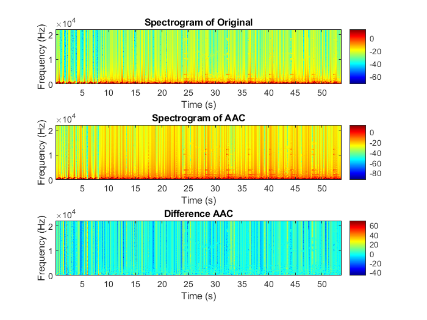
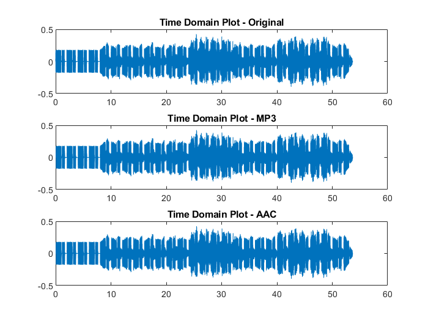
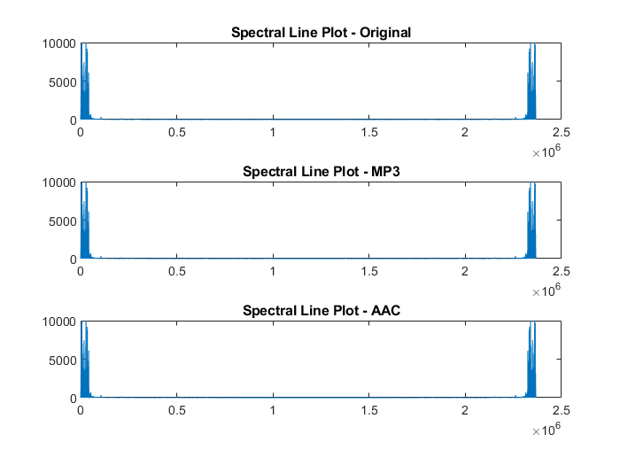
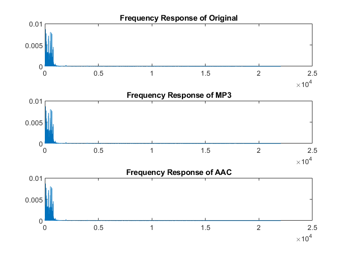
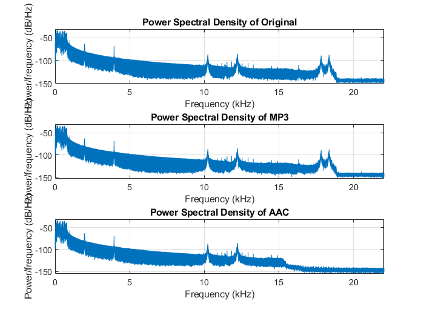
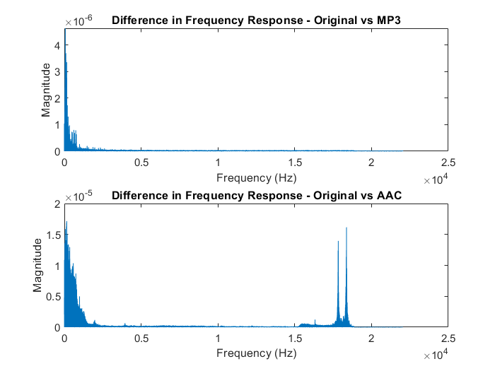

# Audio-Quality-Analysis

Comparision and Audio Quality Analysis of MP3 and AAC Compression Formats

## Description

This project analyzes an original audio file to its compressed variants in MP3 and AAC codecs using audio analysis. 

The main objective is to understand how these popular lossy compression formats affect audio quality and signal properties.

A preprocessing step ensures that the audio files are compared fairly by making the three audio files (original (.wav) , MP3, and AAC) have the same number of channels, sample rate, and length. 

## Results 

### 1. SNR 

SNR between the original audio and the compressed audio files is calculated. 

      SNR Value for mp3 file : -3.0063
      SNR Value for aac file : -2.7980

A higher SNR indicates a higher quality audio file, meaning the noise introduced due to compression is low.

### 2. THD (Total Harmonic Distortion) 

This measurement tells about the harmonic distortion introduced in the audio due to compression.

      THD Value for mp3 file : -20.7849
      THD Value for aac file : -20.7784

### 3. Spectrogram Comparison

Spectrograms and the difference between the spectrograms of the original and compressed audio files provide a visual way to examine the change in  frequency content of the audio files.   

### 4. Time-Domain Plot

Original and compressed audio signals are plotted in the time domain to see how the signal's waveform is altered. 

### 5. Spectral Line Plot 

Magnitude of the FFT (Fast Fourier Transform) of the original and compressed audio signals is plotted. 

This gives a visualization of the audio signal's frequency content.

### 6. Frequency Response

The frequency responses of the original and compressed audio signals offering insight into how the frequency content changes due to compression.

### 7. Power Spectral Density (PSD)

The Power Spectral Density (PSD) of each audio signal is compared. It compares the power present in the frequency components of the signal.

When comparing the PSD plots of the original, MP3, and AAC audio files, there are differences, particularly at high frequencies (15 to 20 KHz).  
The AAC audio file showed lower power at these high frequencies, and two peaks present in the original and MP3 files were missing. 

This suggests that the AAC compression process may have removed or reduced some high-frequency components of the audio signal, which can result in a perceived change in audio quality. These high-frequency components can contribute to the overall sound for professional audio equipments.  

### 8. Zero-Crossing Rate (ZCR)

The ZCR, the rate at which the signal changes its sign shows differences in the audio content. 

High ZCR often indicates the presence of noise or a non-musical sound. 

Results of the ZCR : 
   
    Zero-crossing Rate of Original: 0.016165
    Zero-crossing Rate of MP3: 0.016525
    Zero-crossing Rate of AAC: 0.016119

These values suggest that the compressed audio files (MP3 and AAC) had slightly different zero-crossing rates than the original audio file, which could indicate changes in the audio content due to compression.

### 9. Frequency Response Difference 

Difference in frequency response was computed by taking the absolute difference in the magnitudes of the original frequency response and the frequency responses of the compressed audio files.

Spikes in these plots indicate frequencies where the compression algorithms have noticeably altered the frequency content of the audio signal.

## Summary 

Overall, this project offers numerical metrics (SNR, THD) as well as visual tools (spectrograms, time-domain plots, spectral line graphs) for analyzing and comparing the quality of audio files in their original and compressed versions.

